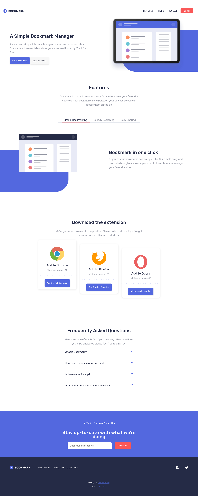

gh-pages -d dist# Frontend Mentor - Designo agency website solution

This is a solution to the [Bookmark landing page challenge on Frontend Mentor](https://www.frontendmentor.io/challenges/bookmark-landing-page-5d0b588a9edda32581d29158). Frontend Mentor challenges help you improve your coding skills by building realistic projects.
## Table of contents

- [Overview](#overview)
  - [Preview](#preview)
  - [Links](#links)
  - [Built with](#built-with)
  - [Installation](#setup)


## Overview

### Preview



### Links

- Live Site URL: [https://daawidziu.github.io/bookmark/](https://daawidziu.github.io/bookmark/)

### Built with

- Semantic HTML5 markup
- Mobile-first workflow
- CSS Flexbox & Grid
- Sass preprocessor
- Gulp
- ES6 Js

### Setup
```
$ cd bookmark
$ npm install
$ npm start
```